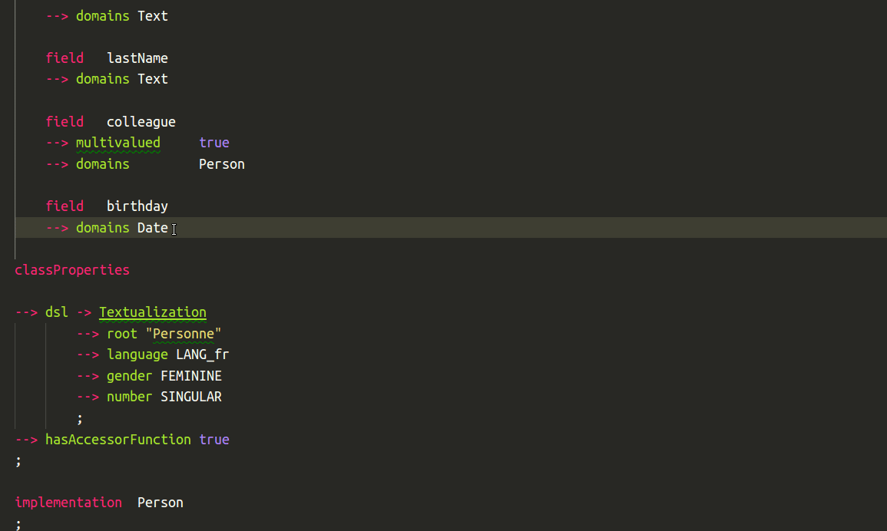

# Yseop Markup Language for VS Code

This extension provides a Yseop Markup Language (YML) basic support for VS Code.

## Features

- Syntax coloring for classic code
- Syntax coloring for text granules and inside text granules
- Snippets (`prefix`: Description):
    * `\amount`: Display amount
    * `\beginList`: Static List
    * `\beginQuote`: Text placed between quotes
    * `\beginStyle`: Styled text
      ***or*** Text using a custom style
    * `\beginSynonym`: List of alternatives
    * `bold`: Bold text
    * `\case`: A case in a “switch” statement
    * `\choice`: An alternative in a list of synonyms
    * `complete`: Complete an instance with values
    * `\endOfLine`: Force end of line
    * `field`: Yml class attribute
    * `\foreach`: “For each” loop
      ***or*** “For each” loop with assembly ID
    * `function`: Function
      ***or*** Function with direct return
    * `granule`: Text granule
    * `instance`: Object instance
    * `interface`: Interface
    * `italic`: Italic text
    * `\nextItem`: An item in a static list
    * `\noContraction`: Prevent contraction
    * `\notEmptyString`: Make sure a string is not considered empty
    * `\nounPhrase`: Noun phrase
    * `numeralStyle`: Display style for numbers
    * `\recipientAction`: Recipient verb
      ***or*** Recipient verb with adjective
    * `round`: Number rounding
    * `\senderAction`: Sender verb
      ***or*** Sender verb with adjective
    * `\switch`: Handle values differently
    * `synonyms`: List of alternatives
    * `TextFunction`: Text function
    * `textu`: Textualization attribute
    * `\thirdAction`: Third person verb
    * `\value`: Display a value
    * `\verb`: Verb

When you start typing a snippet's prefix, the editor should suggest corresponding snippets.

Visual Studio Code uses “tabstops” within snippets in places where code must be written to fill in the blanks. As their name suggest, you can use the tab key to go to the next tabstop.

Some tabstops are associated with a list of predefined values. To use one of them, you can select it using the arrow keys and press `Enter` before using the tab key to proceed as usual if need be.

- Code folding
- KB class attributes completion (needs class to be opened at least once)
- Basic type names completion, based on Yseop Engine's model
    * This feature uses the parameter `yseopml.pathToPredefinedObjectsXml` to get the **absolute** path to the `predefinedObjects.xml` file provided with one of the user's Yseop Engine version's.
    * To edit the parameters, use the shortcut `ctrl + ,`.

[comment]: # (The snippet list can be updated using list-snippets.sh.)
